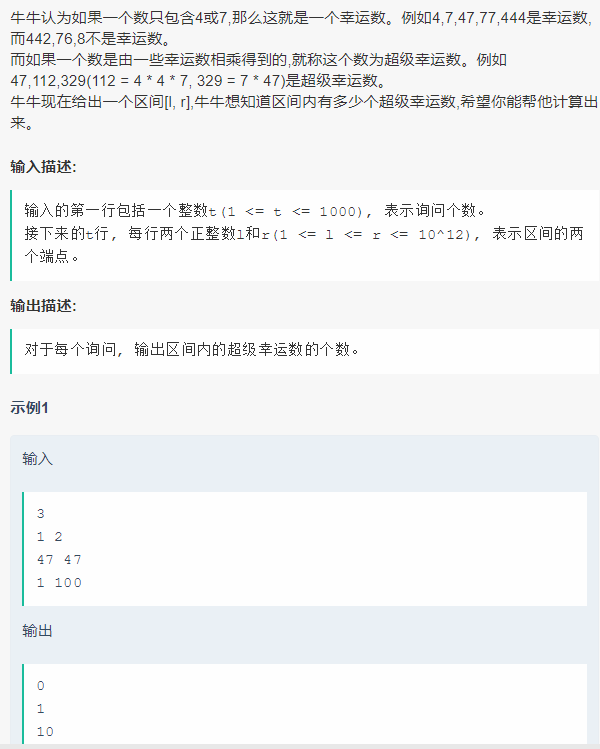

# 1. 最短回文长度


只要有出现奇数的，都得单独拿出来作为一个回文串的中央部分，那么统计奇数个数，将其余多的成对放置在两侧，最短的输出即可。

时间复杂度

O(n)

```c++
#include <bits/stdc++.h>

using namespace std;

int main() {
    int n, a;
    scanf("%d",&n);
    int sum2 = 0, sum1 = 0;
    for(int i = 0; i < n; i++) {
        scanf("%d", &a);
        sum2 += a / 2;
        if(a % 2 == 1) sum1++;
    }
    if(sum1 == 0) printf("%d\n", sum2 * 2);
    else printf("%d\n",sum2 / sum1 * 2 + 1);
}
```

# 2. 飞镖期望


圆环面积等于外圆面积减内圆。每种得分的概率等于对应得分区的面积除以飞镖盘总面积。得分期望等于每一种得分的分值乘上该得分的概率再求和。
注意通过改变运算顺序，规避误差。

时间复杂度

O(n)

```c++
#include <bits/stdc++.h>
using namespace std;

int r[105];
int main() {
    double ans = 0;
    int n, x;
    scanf("%d", &n);
    for(int i = 1; i <= n; i++) scanf("%d", &r[i]);
    scanf("%d", &x);
    for(int i = 1; i <= n; i++)
        ans += 1.0 * (n - i + 1) * (r[i] * r[i] - r[i - 1] * r[i - 1]);
    printf("%.3f\n", (x * ans) / (r[n] * r[n]));
    return 0;
}
```
# 3. 超级幸运数


```c++
dfs暴力生成所有范围内的幸运数,然后再暴力生成所有超级幸运数。
范围内总共有30多万个超级幸运数。

#include <bits/stdc++.h>
using namespace std;

typedef long long LL;
const long long lim = 1e12;

vector<LL> lucky, slucky;
void dfs(LL cur) {
    if(cur > lim) return ;
    if(cur != 0 && cur  <= lim) slucky.push_back(cur);
    dfs(cur * 10 + 4);
    dfs(cur * 10 + 7);
}
void gen(LL cur, int idx, int sz) {
    if(cur != 1 && cur != 0) slucky.push_back(cur);
    for(int i = idx; i < sz; i++) {
        if(cur * slucky[i] <= lim && cur * slucky[i] > 0) {
            gen(cur * slucky[i], i, sz);
        }
        else break ;
    }
}
int main() {
    dfs(0);
    int sz = slucky.size();
    sort(slucky.begin(), slucky.end());
    gen(1, 0, sz);
    sort(slucky.begin() , slucky.end());
    slucky.erase(unique(slucky.begin(), slucky.end()), slucky.end());
    int t;
    scanf("%d", &t);
    while(t--) {
        long long l, r;
        scanf("%lld%lld", &l, &r);
        int ll = lower_bound(slucky.begin(), slucky.end(), l) - slucky.begin();
        int rr = upper_bound(slucky.begin(), slucky.end(), r) - slucky.begin();
        printf("%d\n", rr - ll);
    }
    return 0;
}
```
